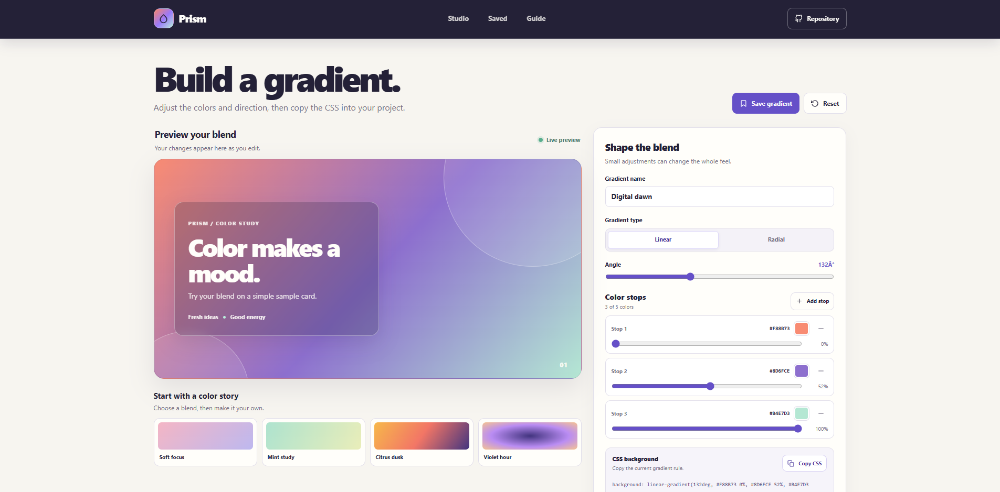

# Color Gradient Explorer

Prism is a browser-based gradient workbench for trying color combinations, adjusting color stops, and copying CSS for a design.

**Live app:** [https://a2rp.github.io/color-gradient-explorer/](https://a2rp.github.io/color-gradient-explorer/)

## What the app includes

- A fixed header with smooth links to the editor, saved gradients, and guide.
- A visible Repository link in the header.
- A large live sample preview that updates as the gradient changes.
- Linear and radial gradient modes.
- A direction control for linear gradients.
- Two to five color stops. Choose each color and set its position from zero to one hundred percent.
- Four starting presets. Choose one and continue editing it.
- A name field, reset control, and CSS output with a copy button.
- A saved gradient collection with controls to load, copy, and delete a saved blend.
- A custom delete dialog that identifies the selected gradient. Keep or delete it with a button, close with Escape, or click outside the dialog.
- A three-step guide, profile and support links in the footer, and a floating Back to top button after scrolling more than 50px.
- Layouts for desktop and mobile screens.

## How to use the editor

1. Choose a preset or start with the current gradient.
2. Choose Linear or Radial. Linear gradients also have an angle control.
3. Use the color picker to change a stop. Move its slider to change where that color appears.
4. Add a stop to use up to five colors. A gradient always keeps at least two stops.
5. Enter a name and select **Save gradient** to keep the current version.
6. Select **Copy CSS** to copy the current background rule.
7. In Saved gradients, select **Use gradient** to load a saved version into the editor. Copy its CSS or delete it from the same card.

The preview, CSS rule, and saved card all use the same gradient settings. Presets replace the current editor settings, so save a gradient first if you want to keep that version.

## How data is stored

This is a front-end tool and has no account or shared server. Saved gradients are stored in the browser's local storage under **prism-saved-gradients**. They remain in the current browser on the current device and are not shared with other visitors. If browser storage is unavailable, the current page can still be used, but saved changes will not remain after it closes. Clearing the site's browser storage removes saved gradients.

## Run locally

Install a current Node.js version, then run these commands from the project folder:

~~~sh
npm install
npm run dev
~~~

Open the local address printed by Vite.

## Lint, build, and deploy

~~~sh
npm run lint
npm run build
npm run deploy
~~~

The deploy command runs the production build first, then publishes the dist folder to the gh-pages branch. GitHub Pages serves the app at [https://a2rp.github.io/color-gradient-explorer/](https://a2rp.github.io/color-gradient-explorer/). Vite uses /color-gradient-explorer/ as its base path. Do not commit the generated dist folder to main.

## Future improvements

These are ideas for later work and are not implemented:

- Add conic gradients and more radial shapes.
- Export a gradient preview as a PNG or SVG file.
- Create shareable links that contain gradient settings.
- Add more presets, searchable collections, and import or export options.
- Add contrast checks for text placed over a gradient.

## Links

- Portfolio: [https://www.ashishranjan.net](https://www.ashishranjan.net)
- GitHub: [https://github.com/a2rp](https://github.com/a2rp)
- CodePen: [https://codepen.io/ash1198](https://codepen.io/ash1198)
- LinkedIn: [https://www.linkedin.com/in/aashishranjan](https://www.linkedin.com/in/aashishranjan)
- Facebook: [https://www.facebook.com/theash.ashish/](https://www.facebook.com/theash.ashish/)
- YouTube: [https://www.youtube.com/@ashishranjan-ashz?sub_confirmation=1](https://www.youtube.com/@ashishranjan-ashz?sub_confirmation=1)
- Email: [mailto:ash.ranjan09@gmail.com](mailto:ash.ranjan09@gmail.com)

## Support

- Support: [https://a2rp-donation-page.netlify.app/](https://a2rp-donation-page.netlify.app/)
- Buy Me a Coffee: [https://buymeacoffee.com/ashishranjan](https://buymeacoffee.com/ashishranjan)
- Patreon: [https://www.patreon.com/ashishranjan](https://www.patreon.com/ashishranjan)